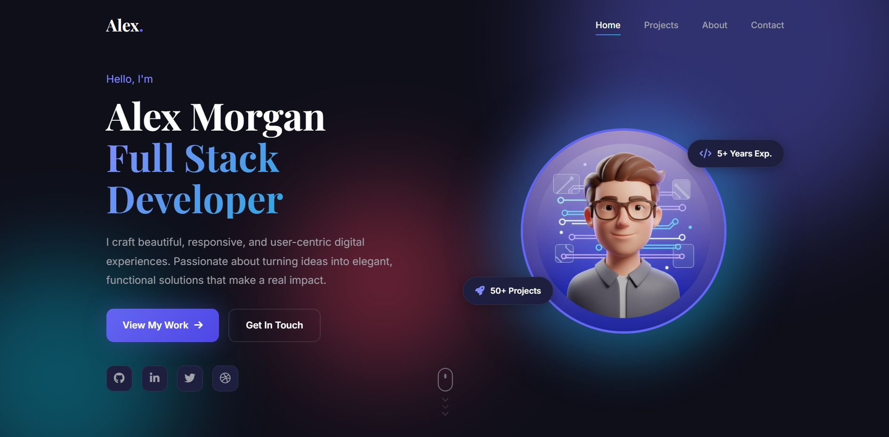

# Professional Portfolio Website

A stunning, modern, and fully responsive personal portfolio website built with pure HTML, CSS, and vanilla JavaScript. No frameworks required - just clean, semantic code that's easy to customize and ready to impress potential clients or employers.



## Live Demo

**[View Live Site](https://ahmedyehia30.github.io/Projects/Responsive-Portfolio-Website/portfolio/index.html)**

## 🌟 Features

### Design & UI
- **Modern Dark Theme** - Elegant color palette with indigo, cyan, and rose accents
- **Animated Background** - Floating geometric shapes with smooth CSS animations
- **Typography Hierarchy** - Google Fonts (Inter + Playfair Display) for professional readability
- **Responsive Layout** - Mobile-first design that works perfectly on all devices
- **Smooth Animations** - Hover effects, scroll-triggered animations, and micro-interactions

### Sections Included
1. **Hero Section** - Eye-catching banner with animated avatar, floating skill badges, and scroll indicator
2. **Projects Showcase** - 4 professional project cards with hover overlays, tech tags, and live/demo links
3. **About Section** - Personal biography with animated skill progress bars and statistics counters
4. **Contact Section** - Styled form with real-time JavaScript validation
5. **Footer** - Social media links, quick navigation, and copyright information

### JavaScript Interactivity
- 📱 Mobile-responsive hamburger menu with smooth toggle
- 🔗 Smooth scrolling navigation between sections
- ✨ Scroll-triggered reveal animations (Intersection Observer API)
- 📊 Animated skill progress bars on scroll
- 🔢 Animated statistics counters
- ✅ Form validation with real-time error feedback
- ⬆️ Dynamic scroll-to-top button
- 🎯 Active navigation link highlighting

## 📁 Project Structure

```
portfolio/
├── index.html              # Main HTML file with semantic structure
├── style.css               # Complete styling with CSS variables and animations
├── script.js               # Vanilla JavaScript for all interactivity
└── assets/
    └── images/
        ├── hero-avatar.jpg # Profile/hero image
        ├── project1.jpg    # E-Commerce Dashboard project
        ├── project2.jpg    # Fitness App project
        ├── project3.jpg    # SaaS Platform project
        └── project4.jpg    # Creative Agency project
```

## 🚀 Quick Start

### Prerequisites
- Any modern web browser (Chrome, Firefox, Safari, Edge)
- Code editor (VS Code, Sublime Text, etc.) - optional for customization

### Installation

1. **Clone or download** the project files
2. **Replace placeholder images** in `assets/images/` with your own:
   - `hero-avatar.jpg` - Your profile photo (recommended: 400x400px)
   - `project1.jpg` through `project4.jpg` - Your project screenshots (recommended: 800x600px)
3. **Open** `index.html` in your browser
4. **Customize** the content (see customization guide below)

That's it! No build process, no dependencies, no npm install required.

## 🎨 Customization Guide

### 1. Personal Information (index.html)
Edit the following sections:

```html
<!-- Hero Section -->
<h1 class="hero-title">Your Name</h1>
<p class="hero-subtitle">Your Title | Your Specialization</p>
<p class="hero-description">Your brief description...</p>

<!-- About Section -->
<p class="about-text">Your biography goes here...</p>

<!-- Contact Section -->
<a href="mailto:your.email@example.com">your.email@example.com</a>
<a href="tel:+1234567890">+1 (234) 567-890</a>
```

### 2. Color Scheme (style.css)
Modify CSS custom properties in the `:root` selector:

```css
:root {
  --primary-color: #6366f1;      /* Indigo - main accent */
  --secondary-color: #06b6d4;   /* Cyan - secondary accent */
  --accent-color: #f43f5e;      /* Rose - highlights */
  --bg-dark: #0f172a;           /* Dark background */
  --bg-card: #1e293b;           /* Card background */
  --text-primary: #f8fafc;      /* Main text */
  --text-secondary: #94a3b8;    /* Secondary text */
}
```

### 3. Projects (index.html)
Update project cards with your own work:

```html
<div class="project-card">
  
  <div class="project-overlay">
    <h3>Your Project Name</h3>
    <p>Brief description of what you built...</p>
    <div class="project-tags">
      <span>React</span>
      <span>Node.js</span>
      <span>MongoDB</span>
    </div>
    <a href="your-demo-link" class="project-link">Live Demo</a>
  </div>
</div>
```

### 4. Skills (index.html)
Update skill bars in the About section:

```html
<div class="skill-bar" data-skill="90">
  <div class="skill-info">
    <span>Your Skill</span>
    <span class="skill-percent">90%</span>
  </div>
  <div class="skill-progress">
    <div class="skill-progress-fill"></div>
  </div>
</div>
```

Change the `data-skill` attribute (0-100) to adjust the percentage.

### 5. Social Links (index.html)
Update social media URLs in the footer:

```html
<div class="social-links">
  <a href="https://github.com/yourusername" aria-label="GitHub">
    <i class="fab fa-github"></i>
  </a>
  <a href="https://linkedin.com/in/yourprofile" aria-label="LinkedIn">
    <i class="fab fa-linkedin"></i>
  </a>
  <!-- Add more as needed -->
</div>
```

## 🛠️ Technical Details

### Technologies Used
| Category | Implementation |
|----------|---------------|
| **Layout** | CSS Grid & Flexbox |
| **Animations** | CSS Keyframes + Intersection Observer API |
| **Icons** | Font Awesome 6 (CDN) |
| **Fonts** | Google Fonts (Inter, Playfair Display) |
| **Validation** | Vanilla JavaScript with Regex |
| **Accessibility** | ARIA labels, focus states, reduced motion support |

### Browser Support
- Chrome 80+
- Firefox 75+
- Safari 13+
- Edge 80+

### Responsive Breakpoints
- **Desktop**: 1200px+ (full layout with side-by-side sections)
- **Tablet**: 768px - 1024px (adjusted grids, smaller typography)
- **Mobile**: < 768px (single column, hamburger menu, stacked layout)

## 📱 Performance Features

- **Semantic HTML5** tags for better SEO and accessibility
- **CSS Variables** for consistent theming and easy customization
- **Intersection Observer** for efficient scroll animations (no jQuery needed)
- **Optimized Images** - Use WebP format for better performance
- **Minimal Dependencies** - Only Font Awesome and Google Fonts (CDNs)
- **Reduced Motion** support for accessibility preferences

## ♿ Accessibility

- Semantic HTML structure with proper heading hierarchy
- ARIA labels for interactive elements
- Keyboard navigation support
- Focus visible states
- Color contrast ratios meeting WCAG 2.1 AA standards
- `prefers-reduced-motion` media query support

## 📝 Code Organization

### HTML (index.html)
- Semantic structure with `<header>`, `<main>`, `<section>`, `<footer>`
- Comments marking each major section
- BEM-inspired class naming convention
- Data attributes for JavaScript hooks

### CSS (style.css)
- CSS custom properties (variables) in `:root`
- Mobile-first responsive approach
- Organized by sections (Header, Hero, Projects, About, Contact, Footer)
- Keyframe animations at the bottom
- Utility classes for common patterns

### JavaScript (script.js)
- Modular functions for each feature
- Event delegation for dynamic elements
- Intersection Observer for scroll animations
- Form validation with regex patterns
- Comments explaining each function

## 🎯 Future Enhancements

Possible additions for your portfolio:
- [ ] Dark/Light theme toggle
- [ ] Blog section with markdown support
- [ ] Testimonials carousel
- [ ] Portfolio filtering by category
- [ ] Multi-language support
- [ ] Service worker for offline viewing
- [ ] Analytics integration

## 📄 License

This project is open source and available under the [MIT License](LICENSE). Feel free to use it for personal or commercial projects. Attribution is appreciated but not required.

## 🤝 Contributing

Contributions are welcome! If you find bugs or have suggestions:
1. Fork the repository
2. Create a feature branch (`git checkout -b feature/amazing-feature`)
3. Commit your changes (`git commit -m 'Add amazing feature'`)
4. Push to the branch (`git push origin feature/amazing-feature`)
5. Open a Pull Request

## 📧 Contact

For questions or support, reach out through:
- Email: your.email@example.com
- LinkedIn: [Your Profile](https://linkedin.com/in/yourprofile)
- GitHub: [Your Username](https://github.com/yourusername)

---

**Happy coding!** 🚀 Build something amazing with this portfolio template.

> "The best way to predict the future is to create it." - Peter Drucker
