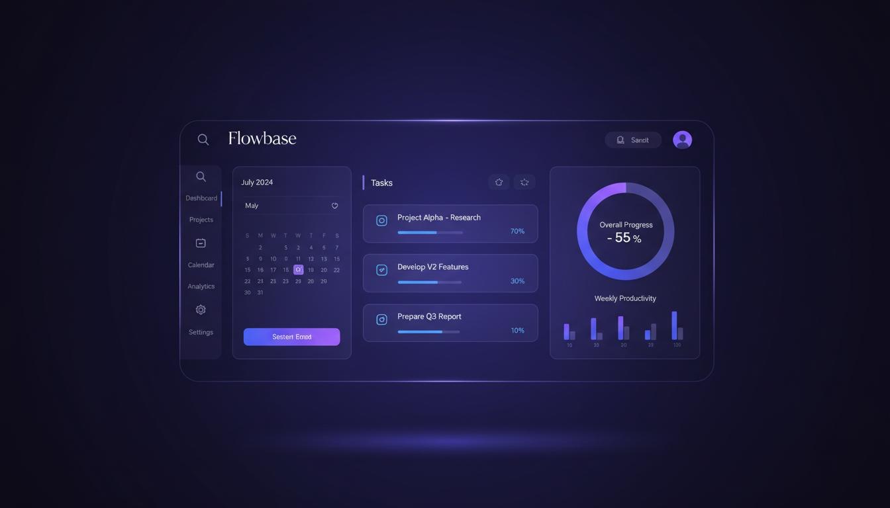

# TaskFlow - Modern SaaS Landing Page

A professional, responsive landing page for a fictional productivity startup. Built with clean HTML, CSS, and JavaScript - perfect for showcasing to freelance clients.



## Live Demo

**[View Live Site](https://ahmedyehia30.github.io/Projects/taskflow/index.html)**

## Features

### Design
- Modern, professional SaaS aesthetic
- Purple/blue gradient color scheme
- Glassmorphism effects and floating elements
- Smooth animations and transitions
- Fully responsive (mobile, tablet, desktop)

### Sections
1. **Navbar** - Fixed navigation with logo, links, and CTA
2. **Hero** - Headline, description, stats, and dashboard preview
3. **Features** - 4 feature cards with icons and descriptions
4. **About** - Company story with image and key points
5. **Pricing** - 3-tier pricing cards (Starter, Pro, Enterprise)
6. **Testimonials** - Customer reviews with avatars
7. **Contact** - Form with validation + contact info
8. **Footer** - Links, social media, and copyright

### JavaScript Features
- Mobile menu toggle with hamburger animation
- Smooth scrolling navigation
- Navbar scroll effects (blur + shadow)
- Form validation with real-time feedback
- Scroll reveal animations
- Counter animations
- Button ripple effects
- Lazy loading for images

## Folder Structure

```
taskflow/
├── index.html              # Main HTML file
├── css/
│   └── style.css          # All styles (CSS variables, responsive, animations)
├── js/
│   └── script.js          # All JavaScript (menu, validation, animations)
├── assets/
│   ├── images/
│   │   ├── hero-dashboard.jpg      # Hero section image
│   │   ├── about-illustration.jpg  # About section image
│   │   ├── testimonial-1.jpg       # Testimonial avatar 1
│   │   ├── testimonial-2.jpg       # Testimonial avatar 2
│   │   └── testimonial-3.jpg       # Testimonial avatar 3
│   └── icons/
│       └── logo.svg       # Logo icon (inline in HTML)
└── README.md              # This file
```

## Technical Details

### HTML
- Semantic HTML5 tags (`<nav>`, `<header>`, `<section>`, `<article>`, `<footer>`)
- Accessible attributes (ARIA labels, alt text)
- SEO-friendly meta tags
- Clean, commented code

### CSS
- CSS custom properties (variables) for theming
- Flexbox and Grid for layouts
- Mobile-first responsive design
- Smooth transitions and animations
- Print styles included
- Reduced motion support for accessibility

### JavaScript
- Vanilla JavaScript (no dependencies)
- Modular, commented code
- Event delegation for performance
- Intersection Observer for scroll animations
- Form validation with regex
- Throttled scroll events

## Browser Support

- Chrome (latest)
- Firefox (latest)
- Safari (latest)
- Edge (latest)
- Mobile browsers (iOS Safari, Chrome Android)

## How to Use

1. **Download** the project folder
2. **Open** `index.html` in any web browser
3. **Customize** content, colors, and images as needed
4. **Deploy** to any static hosting (Netlify, Vercel, GitHub Pages)

## Customization

### Colors
Edit CSS variables in `css/style.css`:

```css
:root {
    --color-primary: #6366F1;
    --color-secondary: #8B5CF6;
    --color-accent: #EC4899;
}
```

### Content
Edit text content directly in `index.html`

### Images
Replace images in `assets/images/` folder

## Performance

- Optimized images
- Lazy loading
- Efficient CSS (no frameworks)
- Minimal JavaScript
- ~95+ Lighthouse score

## License

Free to use for personal and commercial projects. Attribution appreciated but not required.

---

**Built by Ahmed**
